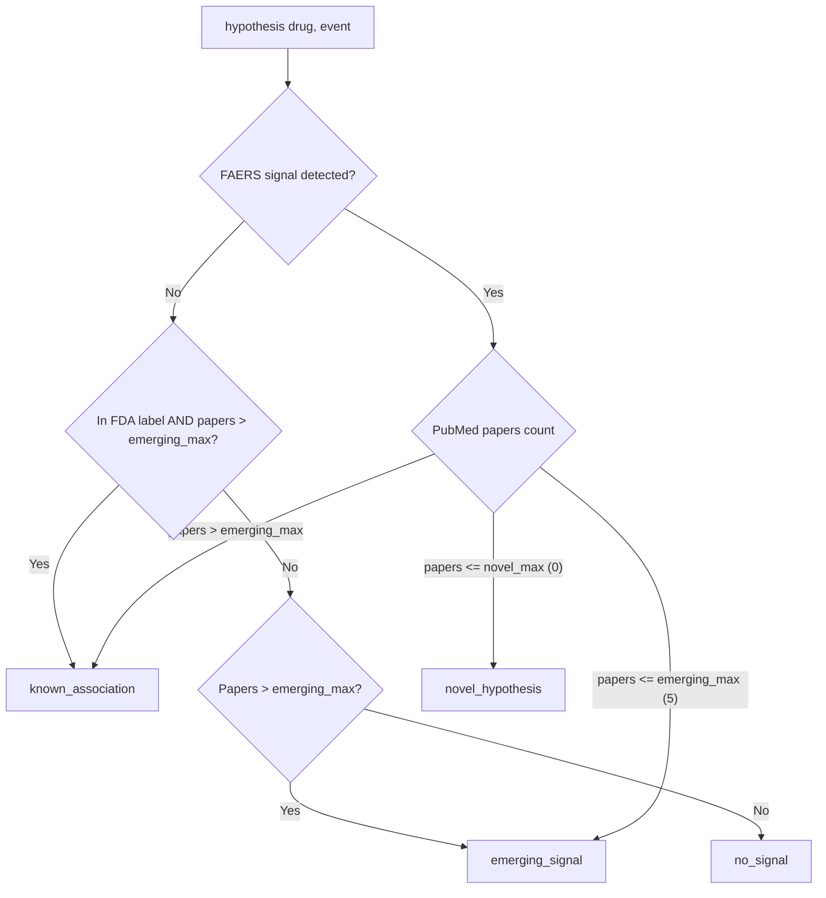

# Cross-Reference API

Cross-reference FAERS signal detection with PubMed literature to classify drug–event hypotheses.

```python
from hypokrates.cross import api as cross  # async
from hypokrates.sync import cross           # sync
```

!!! danger "Research tool — not for clinical decisions"
    hypokrates output is for **screening and hypothesis generation only**. Classification is based on heuristic thresholds. Always validate findings through established pharmacovigilance processes before any clinical action.

---

## `hypothesis()`

Run the full pipeline: FAERS signal detection + PubMed literature search (in parallel via `asyncio.gather`), then classify the result.

```python
result = await cross.hypothesis("propofol", "bradycardia")
print(result.classification)   # HypothesisClassification enum
print(result.summary)          # Human-readable summary
print(result.signal)           # Full SignalResult
print(result.literature_count) # Number of PubMed papers
print(result.articles)         # PubMedArticle list
```

**Parameters**

| Parameter | Type | Default | Description |
|-----------|------|---------|-------------|
| `drug` | `str` | *required* | Generic drug name |
| `event` | `str` | *required* | Adverse event term |
| `novel_max` | `int` | `0` | Max papers for `novel_hypothesis` classification |
| `emerging_max` | `int` | `5` | Max papers for `emerging_signal` classification |
| `literature_limit` | `int` | `5` | Max articles returned from PubMed |
| `use_mesh` | `bool` | `False` | Use MeSH qualifiers for PubMed search |
| `check_label` | `bool` | `False` | Check FDA label via DailyMed |
| `check_trials` | `bool` | `False` | Search ClinicalTrials.gov |
| `check_drugbank` | `bool` | `False` | Check DrugBank for mechanism/interactions |
| `check_opentargets` | `bool` | `False` | Check OpenTargets for LRT score |
| `check_chembl` | `bool` | `False` | Check ChEMBL for mechanism/targets |
| `check_coadmin` | `bool` | `False` | Analyze co-administration confounding (Layer 1 + 2) |
| `suspect_only` | `bool` | `False` | Only count reports where drug is suspect |
| `use_cache` | `bool` | `True` | Use DuckDB cache |

All optional enrichments (`check_label`, `check_trials`, `check_drugbank`, `check_opentargets`, `check_chembl`, `check_coadmin`) degrade gracefully — if any external source is unavailable, a warning is logged and the corresponding field is set to `None` instead of raising an exception.

**Returns:** [`HypothesisResult`](#hypothesisresult)

---

## Classification Logic



### Classification Table

| Signal Detected | In Label | Papers | Classification | Confidence |
|:-:|:-:|:-:|---|---|
| No | — | 0–5 | `no_signal` | n/a |
| No | No | > 5 | `emerging_signal` | moderate |
| No | Yes | > 5 | `known_association` | high |
| Yes | — | 0 | `novel_hypothesis` | low |
| Yes | — | 1–5 | `emerging_signal` | moderate |
| Yes | — | > 5 | `known_association` | high |

> **Note:** Even without a FAERS disproportionality signal, substantial literature and/or FDA label confirmation can indicate a known association. FAERS signals can be absent for well-known adverse events when the drug has very high reporting volume (signal dilution) or when the event is extremely common across all drugs.

### Custom Thresholds

The default thresholds (`novel_max=0`, `emerging_max=5`) are heuristics. Adjust for your domain:

```python
# Stricter — require more literature for "known"
result = await cross.hypothesis(
    "propofol", "bradycardia",
    novel_max=0,
    emerging_max=20,
)

# Looser — for well-studied drug classes
result = await cross.hypothesis(
    "aspirin", "bleeding",
    novel_max=2,
    emerging_max=10,
)
```

---

## Models

### `HypothesisClassification`

`StrEnum` with four values:

| Value | Description |
|-------|-------------|
| `novel_hypothesis` | FAERS signal but no published literature — potential new finding |
| `emerging_signal` | FAERS signal with limited literature — monitor closely |
| `known_association` | FAERS signal with substantial literature — well-documented |
| `no_signal` | No disproportionality signal in FAERS |

### `HypothesisResult`

| Field | Type | Description |
|-------|------|-------------|
| `drug` | `str` | Drug name |
| `event` | `str` | Event term |
| `classification` | `HypothesisClassification` | Hypothesis category |
| `signal` | `SignalResult` | Full signal detection result |
| `literature_count` | `int` | Total PubMed papers found |
| `articles` | `list[PubMedArticle]` | Article metadata |
| `evidence` | `EvidenceBlock` | Provenance and limitations |
| `summary` | `str` | Human-readable summary |
| `thresholds_used` | `dict[str, int]` | `{"novel_max": 0, "emerging_max": 5}` |
| `in_label` | `bool \| None` | Whether event is in FDA label (if `check_label=True`) |
| `active_trials` | `int \| None` | Active clinical trials (if `check_trials=True`) |
| `mechanism` | `str \| None` | Drug mechanism of action (if DrugBank/ChEMBL checked) |
| `ot_llr` | `float \| None` | OpenTargets log-likelihood ratio (if `check_opentargets=True`) |
| `coadmin` | `CoAdminAnalysis \| None` | Co-administration analysis (if `check_coadmin=True`) |

### `CoAdminAnalysis`

Result of co-administration confounding analysis (Layer 1 + Layer 2).

| Field | Type | Description |
|-------|------|-------------|
| `profile` | `CoSuspectProfile` | Layer 1: co-suspect statistics |
| `overlap_ratio` | `float` | Fraction of top-event-drugs that are co-suspects (0–1) |
| `specificity_ratio` | `float \| None` | Drug PRR / median co-drug PRR (if computed) |
| `is_specific` | `bool` | `True` = drug-specific signal |
| `co_signals` | `list[CoSignalItem]` | PRR for each co-drug tested |
| `verdict` | `str` | `"specific"`, `"co_admin_artifact"`, or `"inconclusive"` |

### `CoSignalItem`

| Field | Type | Description |
|-------|------|-------------|
| `drug` | `str` | Co-drug name |
| `prr` | `float` | PRR for the co-drug + event |
| `signal_detected` | `bool` | Whether signal was detected |
