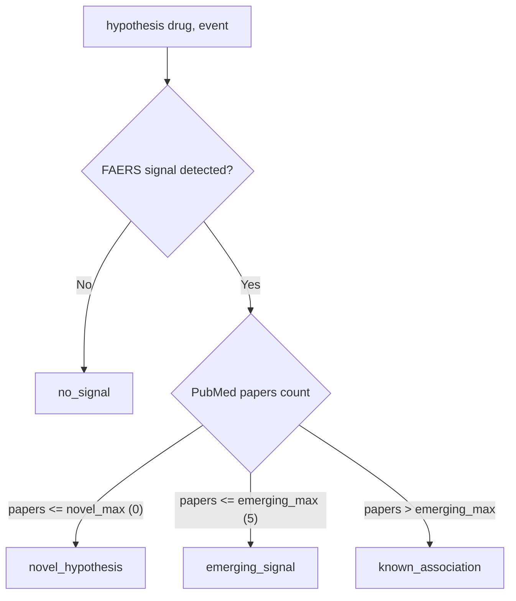

# Cross-Reference API

Cross-reference FAERS signal detection with PubMed literature to classify drug–event hypotheses.

```python
from hypokrates.cross import api as cross  # async
from hypokrates.sync import cross           # sync
```

!!! danger "Research tool — not for clinical decisions"
    hypokrates output is for **screening and hypothesis generation only**. Classification is based on heuristic thresholds. Always validate findings through established pharmacovigilance processes before any clinical action.

---

## `hypothesis()`

Run the full pipeline: FAERS signal detection + PubMed literature search (in parallel via `asyncio.gather`), then classify the result.

```python
result = await cross.hypothesis("propofol", "bradycardia")
print(result.classification)   # HypothesisClassification enum
print(result.summary)          # Human-readable summary
print(result.signal)           # Full SignalResult
print(result.literature_count) # Number of PubMed papers
print(result.articles)         # PubMedArticle list
```

**Parameters**

| Parameter | Type | Default | Description |
|-----------|------|---------|-------------|
| `drug` | `str` | *required* | Generic drug name |
| `event` | `str` | *required* | Adverse event term |
| `novel_max` | `int` | `0` | Max papers for `novel_hypothesis` classification |
| `emerging_max` | `int` | `5` | Max papers for `emerging_signal` classification |
| `literature_limit` | `int` | `5` | Max articles returned from PubMed |
| `use_mesh` | `bool` | `False` | Use MeSH qualifiers for PubMed search |
| `use_cache` | `bool` | `True` | Use DuckDB cache |

**Returns:** [`HypothesisResult`](#hypothesisresult)

---

## Classification Logic



### Classification Table

| Signal Detected | Papers | Classification | Confidence |
|:-:|:-:|---|---|
| No | any | `no_signal` | n/a |
| Yes | 0 | `novel_hypothesis` | low |
| Yes | 1–5 | `emerging_signal` | moderate |
| Yes | > 5 | `known_association` | high |

### Custom Thresholds

The default thresholds (`novel_max=0`, `emerging_max=5`) are heuristics. Adjust for your domain:

```python
# Stricter — require more literature for "known"
result = await cross.hypothesis(
    "propofol", "bradycardia",
    novel_max=0,
    emerging_max=20,
)

# Looser — for well-studied drug classes
result = await cross.hypothesis(
    "aspirin", "bleeding",
    novel_max=2,
    emerging_max=10,
)
```

---

## Models

### `HypothesisClassification`

`StrEnum` with four values:

| Value | Description |
|-------|-------------|
| `novel_hypothesis` | FAERS signal but no published literature — potential new finding |
| `emerging_signal` | FAERS signal with limited literature — monitor closely |
| `known_association` | FAERS signal with substantial literature — well-documented |
| `no_signal` | No disproportionality signal in FAERS |

### `HypothesisResult`

| Field | Type | Description |
|-------|------|-------------|
| `drug` | `str` | Drug name |
| `event` | `str` | Event term |
| `classification` | `HypothesisClassification` | Hypothesis category |
| `signal` | `SignalResult` | Full signal detection result |
| `literature_count` | `int` | Total PubMed papers found |
| `articles` | `list[PubMedArticle]` | Article metadata |
| `evidence` | `EvidenceBlock` | Provenance and limitations |
| `summary` | `str` | Human-readable summary |
| `thresholds_used` | `dict[str, int]` | `{"novel_max": 0, "emerging_max": 5}` |
