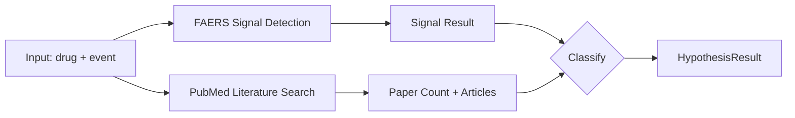
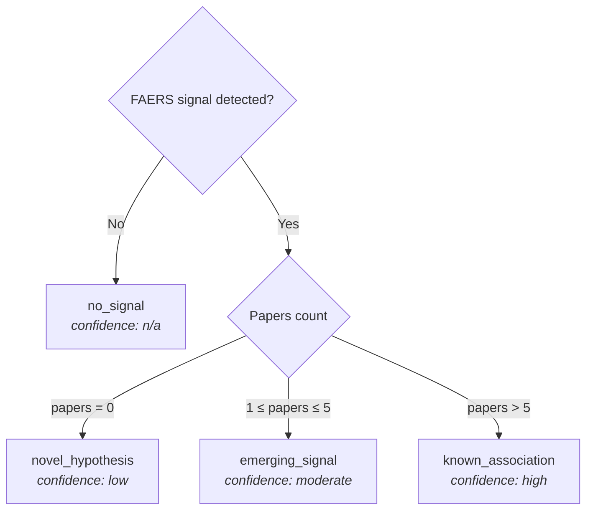

# Hypothesis Generation

The `hypothesis()` function is the main entry point of hypokrates. It combines FAERS signal detection with PubMed literature search to classify drug–adverse event pairs into one of four categories.

## Pipeline



The FAERS and PubMed queries run **in parallel** using `asyncio.gather()` for optimal performance.

### Step by step

1. **FAERS signal detection** — Fetch counts, build 2x2 table, compute PRR/ROR/IC
2. **PubMed literature search** — Search for published papers on the drug–event pair
3. **Classification** — Combine signal + literature count into a category
4. **Evidence assembly** — Attach provenance, limitations, and methodology

---

## Classification

The classification depends on two inputs:

- **Signal detected?** — Does the drug–event pair show disproportionality in FAERS?
- **Literature count** — How many PubMed papers exist for this pair?



### The Four Categories

| Classification | Signal | Papers | Meaning | Action |
|---|:-:|:-:|---|---|
| **`novel_hypothesis`** | Yes | 0 | FAERS signal with no published literature. Potential new finding. | Investigate — may be a genuine discovery or a data artifact. |
| **`emerging_signal`** | Yes | 1–5 | FAERS signal with limited published evidence. | Monitor closely — evidence is accumulating. |
| **`known_association`** | Yes | > 5 | FAERS signal well-supported by literature. | Well-documented — likely already in drug labels. |
| **`no_signal`** | No | any | No disproportionality signal in FAERS. | No action from FAERS data (doesn't rule out the association). |

### Clinical Examples

- **Novel hypothesis:** A new anesthetic shows elevated bradycardia reports in FAERS, but no published case reports or studies exist yet.
- **Emerging signal:** A few case reports document propofol-related QT prolongation, and FAERS shows disproportionality — evidence is building.
- **Known association:** Propofol + bradycardia has hundreds of papers and is documented in the product label.
- **No signal:** Paracetamol + bradycardia shows no disproportionality in FAERS.

---

## Thresholds

The classification thresholds are configurable:

| Parameter | Default | Effect |
|-----------|---------|--------|
| `novel_max` | `0` | Papers ≤ `novel_max` → `novel_hypothesis` |
| `emerging_max` | `5` | Papers ≤ `emerging_max` → `emerging_signal` |

Papers above `emerging_max` → `known_association`.

```python
# Default thresholds
result = await cross.hypothesis("propofol", "bradycardia")

# Custom thresholds for a well-studied domain
result = await cross.hypothesis(
    "propofol", "bradycardia",
    novel_max=2,    # up to 2 papers still considered "novel"
    emerging_max=20, # up to 20 papers considered "emerging"
)
```

!!! warning "Thresholds are heuristics"
    These are not validated clinical cutoffs. Adjust them based on your domain knowledge and the typical literature volume for the drug class you're studying.

---

## Confidence Labels

Each classification maps to a confidence label:

| Classification | Confidence | Rationale |
|---|---|---|
| `novel_hypothesis` | `low — no corroborating literature` | Signal exists but no external validation |
| `emerging_signal` | `moderate — limited corroborating literature` | Some published evidence supports the signal |
| `known_association` | `high — well-documented in literature` | Substantial published evidence |
| `no_signal` | `n/a — no signal detected` | Not applicable |

The confidence label is stored in `result.evidence.confidence`.
