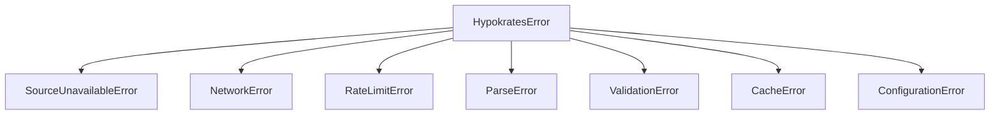

# Error Handling

hypokrates uses a structured exception hierarchy rooted in `HypokratesError`. All exceptions are importable from `hypokrates.exceptions`.

## Exception Hierarchy



---

## Exceptions

### `HypokratesError`

Base exception for all hypokrates operations. Catch this to handle any library error:

```python
from hypokrates.exceptions import HypokratesError

try:
    result = await faers.adverse_events("propofol")
except HypokratesError as e:
    print(f"hypokrates error: {e}")
```

### `SourceUnavailableError`

Raised when a data source is temporarily unavailable (e.g., OpenFDA is down).

| Attribute | Type | Description |
|-----------|------|-------------|
| `source` | `str` | Source name (e.g., `"OpenFDA/FAERS"`) |
| `detail` | `str` | Additional detail |

```python
from hypokrates.exceptions import SourceUnavailableError

try:
    result = await faers.adverse_events("propofol")
except SourceUnavailableError as e:
    print(f"{e.source} is down: {e.detail}")
```

### `NetworkError`

Raised on network failures: timeout, DNS resolution, connection refused.

| Attribute | Type | Description |
|-----------|------|-------------|
| `url` | `str` | URL that failed |
| `detail` | `str` | Error detail |

```python
from hypokrates.exceptions import NetworkError

try:
    result = await faers.adverse_events("propofol")
except NetworkError as e:
    print(f"Network error for {e.url}: {e.detail}")
```

### `RateLimitError`

Raised when a source's rate limit is exceeded (HTTP 429).

| Attribute | Type | Description |
|-----------|------|-------------|
| `source` | `str` | Source name |
| `retry_after` | `float \| None` | Seconds to wait before retrying |

```python
from hypokrates.exceptions import RateLimitError

try:
    result = await faers.adverse_events("propofol")
except RateLimitError as e:
    if e.retry_after:
        print(f"Rate limited. Retry after {e.retry_after}s")
```

!!! note "Automatic retry"
    hypokrates retries rate-limited requests automatically with exponential backoff (up to `http_max_retries` times). `RateLimitError` is only raised when all retries are exhausted.

### `ParseError`

Raised when the API response cannot be parsed (unexpected format, missing fields).

| Attribute | Type | Description |
|-----------|------|-------------|
| `source` | `str` | Source name |
| `detail` | `str` | What went wrong |

### `ValidationError`

Raised when user input fails validation (e.g., invalid drug name, empty string).

### `CacheError`

Raised when the DuckDB cache encounters an error (corruption, disk full, permissions).

### `ConfigurationError`

Raised when `configure()` receives an unknown parameter.

```python
from hypokrates.config import configure

configure(invalid_param="value")  # raises ConfigurationError
```

---

## Retry Behavior

hypokrates automatically retries failed HTTP requests:

| Status Code | Meaning | Retried? |
|:-----------:|---------|:--------:|
| 429 | Rate limit exceeded | Yes |
| 500 | Internal server error | Yes |
| 502 | Bad gateway | Yes |
| 503 | Service unavailable | Yes |
| 504 | Gateway timeout | Yes |
| 4xx (other) | Client error | No |

Retries use **exponential backoff** with jitter. Configure max retries via:

```python
from hypokrates.config import configure
configure(http_max_retries=5)  # default: 3
```

## Recommended Pattern

```python
from hypokrates.exceptions import (
    HypokratesError,
    RateLimitError,
    SourceUnavailableError,
)

try:
    result = await cross.hypothesis("propofol", "bradycardia")
except RateLimitError as e:
    # All retries exhausted — back off or use cache
    log.warning(f"Rate limited by {e.source}")
except SourceUnavailableError as e:
    # Source is down — fail gracefully
    log.error(f"{e.source} unavailable: {e.detail}")
except HypokratesError as e:
    # Catch-all for other library errors
    log.error(f"Unexpected error: {e}")
```
